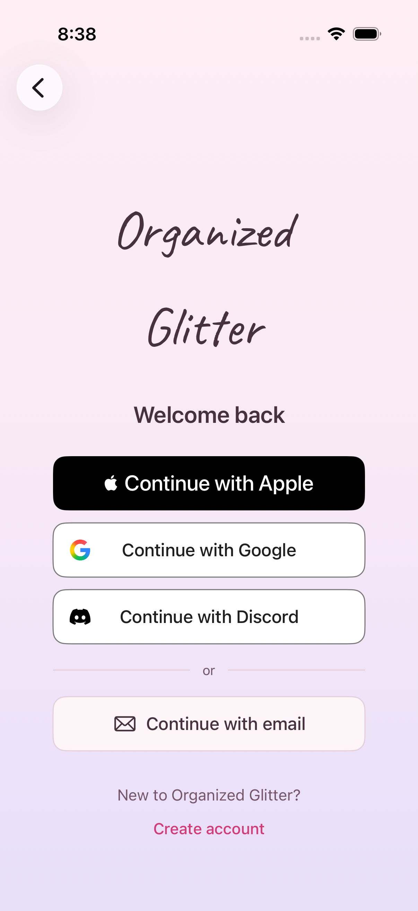
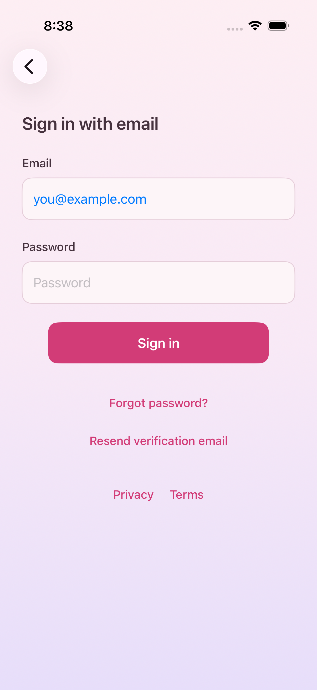
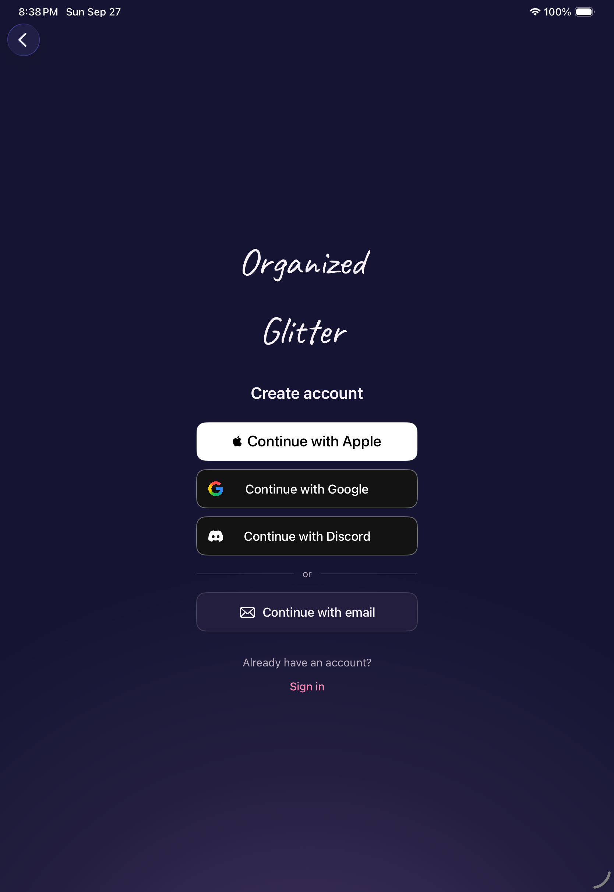

# Account-entry presentation

This refinement is stacked on native Apple sign-in PR #18. It preserves the
Berry Cream background, wordmark, provider readiness, and authentication paths.

- Primary actions are centered and capped at 280 points; provider choices at
  300 points. Forms have a 360-point reading width on iPad.
- Buttons retain at least 52-point heights and expand for larger text. Apple's
  native control has an explicit scaled height instead of an unbounded minimum.
- Google and Discord use their original marks, with email below the providers.
- Registration, sign-in, reset confirmation, reset requests, and verification
  requests share the same primary style and stable loading label.
- Account-switch prompts stack so long text does not compete with the action.

## Provider artwork

These are third-party trademarks, excluded from the repository's Apache-2.0
artwork license. They identify authentication options only.

- Google: original [G asset](https://developers.google.com/static/identity/images/g-logo.png),
  obtained from [Sign in with Google branding guidance](https://developers.google.com/identity/branding-guidelines).
  The original multicolor mark is retained on neutral white/dark surfaces.
- Discord: original black and white Clyde SVGs from the
  [official brand page](https://discord.com/branding), downloaded from the linked
  [black archive](https://cdn.discordapp.com/assets/content/aecd9009fd6a24c06c8ce71f6bb84463eaf7252bc5259022fb887b381a428250.zip)
  and [white archive](https://cdn.discordapp.com/assets/content/80af2c38f13b4a7d2cb3572e1220f6e958d3c3aedccc7c7d3ddc9832f6b3d725.zip).
  Geometry and fills are unchanged; the asset catalog chooses white in dark mode.

Provider logos are decorative within buttons whose full text supplies their
accessible name. No new third-party SDK is used.

## Verification

- iOS 26.5 iPhone: unit suite and focused UI checks for method ordering, native
  account entry, and reset-link recovery. Debug and Release simulator builds.
- Captured welcome, both method modes, registration, email sign-in, and password
  reset on iPhone in light appearance, iPad in dark appearance, and iPhone at
  accessibility-extra-large in dark appearance. Large text scrolls and wraps.
- Provider screenshots use fixture Google/Discord availability. The captures
  precede the PR #18 Release-enablement rebase; its Debug presentation is the same.
- Provider authorization and physical-device behavior are outside this visual
  change's verification; this does not replace PR #18's release checks.

| iPhone methods | iPhone email | iPad dark methods |
| --- | --- | --- |
|  |  |  |
